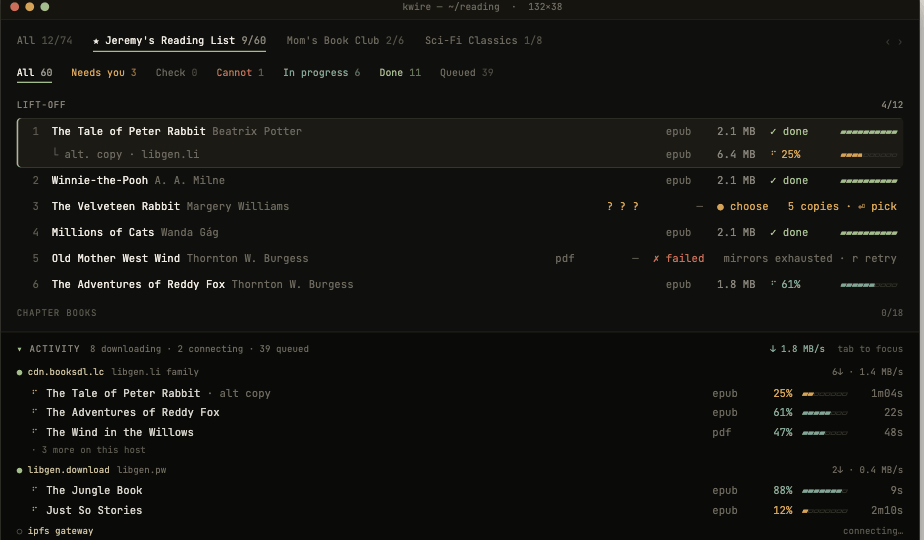
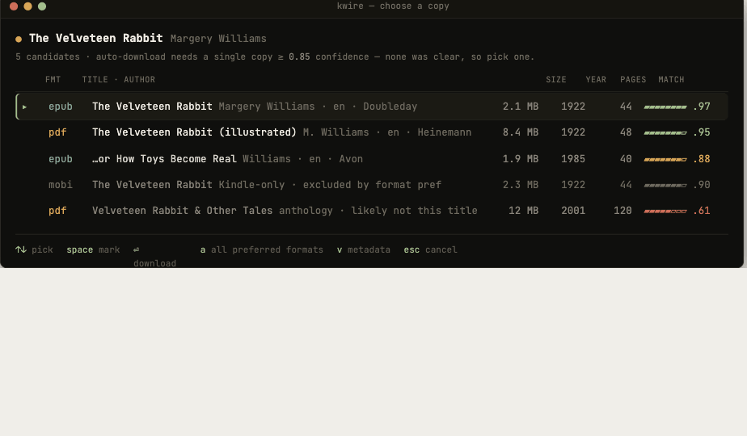
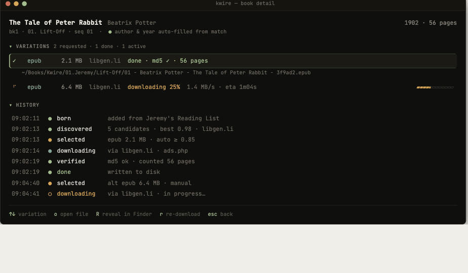
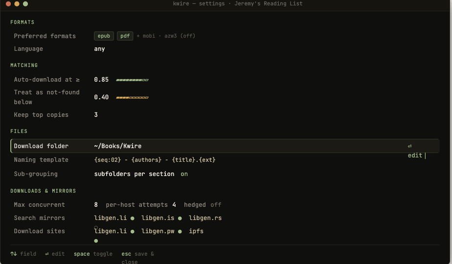
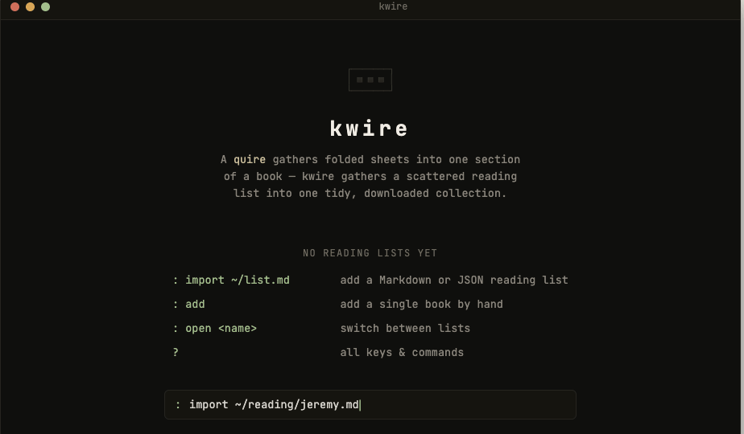
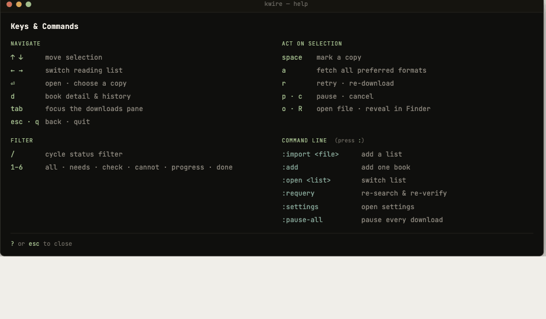

# Kwire TUI — terminal frontend over `libgen-core`

> **Developer handoff · v1.** A blueprint for building the ratatui terminal app as a
> third frontend on the existing engine, alongside the Tauri desktop app and the CLI.
> It maps every pane and keystroke in the approved mockup to concrete ratatui widgets
> and the engine calls behind them. Nothing here changes the engine's behavior — it
> reuses the `Command` / `Event` surface the desktop app already speaks.

**The one rule.** The engine never learns it has a TUI. `libgen-core` stays free of
`ratatui`, `crossterm`, and `tauri` deps. The TUI drives it with `Command`s and renders
from `snapshot()` + observed `Event`s.

The interactive mockup these shots come from is bundled at
[`tui-mock/kwire-tui-mock.html`](tui-mock/kwire-tui-mock.html) — open it in a browser to
see the live layout, animated progress, and every screen. **It is the source of truth for
the UX**; this document is the engineering spec.

---

## Screens

### Main library — book list + docked Activity pane
The hero screen. A one-line **list strip** (← → cycles reading lists), a **status-filter
row**, the **book table** with live per-variation download state, and a **docked Activity
pane** (not a popup) that stays visible while you navigate the list. Bottom is the
key-hint bar.



### Choose a copy — ambiguous match → pick a variation
Opens when a book is `NeedsSelection`. A candidate table with format, size, year, pages,
and match score; `⏎` downloads the highlighted copy, `a` fetches all preferred formats.



### Book detail — variations + event-history timeline
Per-variation state (one `Done` epub while a second downloads) plus the book's full
chronicle: born → discovered → selected → downloading → verified → done.



### Settings · Empty / first run · Help




---

## Main-screen wireframe (character grid)

The TUI is a character grid; this is the faithful layout spec. Regions correspond 1:1 to
the `Layout` constraints in §4.

```
┌ kwire — ~/reading · 132×38 ─────────────────────────────────────────────────────────┐
│ All 12/74   ★ Jeremy's Reading List 9/60   Mom's Book Club 2/6   Sci-Fi Classics 1/8 │  ← list strip   (← → switch)
│ All 60   Needs you 3   Check 0   Cannot 1   In progress 6   Done 11   Queued 39      │  ← status filter (1–6 / /)
│ LIFT-OFF                                                                         4/12 │  ← group header
│  1  The Tale of Peter Rabbit  Beatrix Potter      epub  2.1 MB  ✓ done   ▰▰▰▰▰▰▰▰▰▰   │  ┐
│       └ alt. copy · libgen.li                     epub  6.4 MB  ⠹ 25%    ▰▰░░░░░░░░   │  │ book Table
│  2  Winnie-the-Pooh  A. A. Milne                  epub  2.1 MB  ✓ done   ▰▰▰▰▰▰▰▰▰▰   │  │ (grows; ↑↓ select)
│  3  The Velveteen Rabbit  Margery Williams        ???   —       ● choose 5 copies     │  │
│  …                                                                                   │  ┘
│ ▾ ACTIVITY  8 downloading · 2 connecting · 39 queued        ↓ 1.8 MB/s   tab to focus │  ┐ docked Activity
│ ● cdn.booksdl.lc  libgen.li family                              6↓ · 1.4 MB/s        │  │ (Length(N); collapsible)
│    ⠹ The Tale of Peter Rabbit · alt copy          epub  25%  ▰▰░░░░  1m04s            │  │
│    ⠹ The Adventures of Reddy Fox                  epub  61%  ▰▰▰▰▰░  22s              │  ┘
│ ↑↓ move  ←→ list  ⏎ open  d detail  / filter  : command  tab downloads  ? help  q    │  ← hint bar / command line
└──────────────────────────────────────────────────────────────────────────────────────┘
```

---

## 1 · Workspace & the one prerequisite

The engine (`crates/core`) and CLI (`crates/cli`) are already UI-agnostic. The catch: the
*concurrency driver* that owns orchestrators, runs query/download passes off-lock, drains
events, and projects the `ViewModel` currently lives **inside the Tauri crate**
(`app/src-tauri/src/engine.rs`, `state.rs`, `viewmodel.rs`, `bridge.rs`). It has no
Tauri-specific logic except the command shim, so **Step 1 is to lift it into a shared
crate** both frontends link. **(Decided: do this now.)**

```
kwire/
├── crates/
│   ├── core/          libgen-core   — engine (no UI). unchanged
│   ├── engine/   ◄──  libgen-engine — NEW shared driver: owns Orchestrators +
│   │                  Scheduler, runs passes, emits Events, projects ViewModel
│   │                  (move engine.rs / state.rs / viewmodel.rs / bridge.rs here)
│   ├── cli/           libgen-cli    — dev harnesses. unchanged
│   └── tui/      ◄──  libgen-tui    — NEW ratatui binary  (this document)
└── app/src-tauri/     thin #[tauri::command] shim over libgen-engine
```

After the move, `app/src-tauri` keeps only `commands.rs` + `main.rs`; the TUI links
`libgen-engine` + `ratatui` + `crossterm`. The Tauri app must keep building and passing its
tests against the relocated driver before the TUI work starts.

## 2 · Runtime contract

One `Orchestrator` exists per persisted list. The frontend issues commands and observes
events; it never touches the network or DB.

| Surface | What the TUI uses it for |
|---|---|
| **`Command`** — `QueryAll`, `StartDownloads`, `SelectCandidate{group_path,book_index,md5}`, `Retry{…}` | High-level intents. The richer per-book methods below are usually called directly from the driver, but the enum is the stable contract. |
| **`Event`** — `StatusChanged`, `QueryStage{stage}`, `Planned{destination}`, `Download(Progress)`, `Done` | Streamed over an `mpsc::Receiver<Event>`. Drives the live book-row states and the docked Activity pane. `Download(Progress)` carries bytes/speed/eta per md5. |
| **`snapshot() -> DownloadList`** | Full current state of a list, reloaded from the store. Project through `ViewModel` for rendering. Cheap; call on any change event. |
| **per-book methods** — `select_candidate`, `retry`, `edit_book_input`, `update_settings`, `set_format_pref`, `reverify_one`, `query_one` | Everything a keystroke needs. All take `(group_path: &[usize], book_index: usize, …)` and persist immediately. |
| **`queue::Scheduler` + `Progress`** | Per-host queues, rate limits, retry/failover, pause/cancel/resume. Shared across lists. The Activity pane is a view of its in-flight transfers. |

Persistence is automatic (`store::Store`, SQLite schema v2) so quit/crash resumes cleanly
— the TUI gets resume-on-launch for free. The `begin_*/finish_*` method pairs run
search/download *off* the per-list lock; reuse the driver's existing loop rather than
re-deriving that concurrency.

## 3 · The event loop

A single `tokio` task owns the screen and selects over three sources: terminal input,
engine events, and a redraw tick. Both worlds are async, so input and engine progress
interleave without threads.

```rust
let mut input = crossterm::event::EventStream::new();
let mut ticks = tokio::time::interval(Duration::from_millis(120)); // progress redraw
// setup: raw mode + EnterAlternateScreen + EnableMouseCapture — teardown reverses, even on panic

loop {
    tokio::select! {
        Some(Ok(ev)) = input.next() => {
            match app.on_input(ev) {               // key OR mouse → pure; returns intent
                Intent::Select{gp, bi, md5} => engine.select_candidate(&gp, bi, &md5)?,
                Intent::Retry{gp, bi}       => engine.retry(&gp, bi)?,
                Intent::Command(line)       => app.run_command(line, &mut engine).await?,
                Intent::Quit                => break,
                Intent::Redraw              => {}  // nav / filter / focus — UI only
            }
        }
        Some(evt) = engine_events.recv() => app.apply(evt),  // StatusChanged / Download / …
        _ = ticks.tick() => {}                                // keep spinners + bars moving
    }
    terminal.draw(|f| ui::render(f, &app))?;   // re-render from AppState every pass
}
```

## 4 · Layout & the docked Activity pane

The main screen is one `Layout` split vertically. The Activity pane is **not a popup** — it
is a fixed-height region of the same frame, so the book list stays fully visible and
navigable while downloads run.

```rust
Layout::vertical([
    Constraint::Length(1),                       // list strip  (← → cycle lists)
    Constraint::Length(1),                       // status-filter row
    Constraint::Min(8),                          // book Table — grows to fill
    Constraint::Length(activity_h),              // docked Activity pane (collapsible)
    Constraint::Length(1),                       // key-hint bar / command line
])
// activity_h = 1 when collapsed (just the summary line),
//            = N when expanded. `tab` moves focus into it; ↑↓ then scroll transfers.
```

Focus is a small enum — `Focus::{List, Activity, Modal(_)}`. `tab` toggles List↔Activity;
modals capture focus until `esc`. The hint bar reads the active focus to show contextual
keys.

## 5 · Pane → widget → data → engine

| Pane | ratatui widget(s) | Data source | Engine call(s) |
|---|---|---|---|
| **List strip** | `Tabs` or styled `Line` | one entry per `ViewModel` + per-list done/total roll-up | ← → switch active `Orchestrator` (reload its `snapshot()`) |
| **Status filter row** | `Line` of spans | counts from `discovery` + `acquisition()` roll-ups | UI-only filter over the snapshot |
| **Book list** (hero) | `Table` + `TableState`; group-header rows; progress cell = block-char string | `ViewBook` per row; per-variation `state/progress`; flat `bkN` id ↔ tree position | ↑↓ select; ⏎ open; live updates via `StatusChanged`/`Download` |
| **Activity pane** | `Block` + per-host group rows; `LineGauge` per transfer | in-flight variations across *all* lists; `Progress` keyed by md5 + host | `Scheduler` telemetry; p/c → pause/cancel a focused transfer |
| **Choose a copy** | `Clear` + centered `Block` + candidate `Table` | the book's `versions: Vec<ViewVariation>` (md5, fmt, size, year, pages, `score`) | ⏎ → `select_candidate(gp,bi,md5)`; a → request all preferred formats |
| **Book detail** | modal `Block`; Variations `Table` + History `List` | `versions` + `history: Vec<ViewEvent>` (at_ms, kind, detail) | o open file · R reveal (`output_path`); r → `retry` |
| **Settings** | key-value `List`; inline edit field for the focused row | `ViewListSettings` + `ViewAppConfig`; mirror health | ⏎ commit → `update_settings(ListSettings)` / `set_format_pref` |
| **Empty / help** | centered `Paragraph` / two-column `Table` | static; empty = library has no lists | : command line; ? toggles help |

**Reuse `ViewModel` verbatim.** It already normalizes per-variation state, roll-ups, page
counts, and history into render-ready strings — the same shape the web UI consumes. Extract
it from `app/src-tauri/src/viewmodel.rs` into `libgen-engine` (it has zero Tauri deps) and
the TUI renders from it directly — no second projection to keep in sync.

## 6 · Keymap → engine

| Key | Action | Engine call |
|---|---|---|
| `↑ ↓` / `j k` | move selection (into Activity at list end) | — UI only |
| `← →` | switch reading list | swap active orchestrator · `snapshot()` |
| `⏎` | open: NeedsSelection → picker, else detail | — opens modal |
| `⏎` (picker) | choose this copy → download | `select_candidate` → pass |
| `a` | fetch all preferred formats | request each kept variation |
| `d` | book detail & history | — reads snapshot |
| `r` | retry / re-download | `retry(gp, bi)` |
| `p · c` | pause · cancel transfer | `Scheduler` pause/cancel |
| `o · R` | open file · reveal in Finder | `open` on `output_path` |
| `/ · 1–6` | cycle / set status filter | — UI only |
| `tab` | focus downloads pane | — UI focus |
| `:` | command line (below) | parse + dispatch |
| `? · esc · q` | help · back · quit | — UI only |

**Command line (`:`)**

| Command | Effect |
|---|---|
| `:import <file.md\|json>` | `parse::*` → `DownloadList` → `Orchestrator::new` + `QueryAll` |
| `:add` | append to the manual list (`is_manual`) → query that book |
| `:open <list>` | switch active orchestrator |
| `:requery` | re-discover queued books · `reverify_one` on downloaded copies |
| `:settings` · `:pause-all` · `:quit` | open settings · `Scheduler` pause-all · graceful exit |

**Mouse (enabled).** Turn on with `EnableMouseCapture` and route clicks to the *same*
intents as keys: a book row → select, a list tab → switch list, a filter chip → set filter,
the Activity header → collapse/expand, a transfer row → focus it. The wheel scrolls
whichever pane holds focus. Handle these as `Event::Mouse` inside `on_input` so keyboard and
mouse share one reducer (and one test path). Hit-testing maps a click's `(col,row)` against
the `Rect`s the last `Layout` produced.

## 7 · Rendering & theme

Truecolor (24-bit): `Style::default().fg(Color::Rgb(r,g,b))`. The mockup's "Quiet" palette —
carry these into a single `theme.rs`:

| Role | Hex | Role | Hex |
|---|---|---|---|
| done / accent | `#a3be8c` | needs-you / paused | `#d8a657` |
| downloading | `#83a598` | failed / cannot | `#cf6f5a` |
| text / bright | `#d6d3cc` / `#f0ece4` | dim / faint | `#8a857c` / `#5c5750` |
| background | `#0f0f0d` | panel / selected row | `#15140f` / `#1b1a14` |

- Progress bars: render `▰`/`▱` from `progress: u32`, or use `LineGauge` in the Activity
  pane. Spinner = braille frames advanced on the redraw tick.
- Selected row = full-width reverse/dim bar with a left accent cell; never rely on color
  alone (also bold the title) so the 16-color fallback still reads.
- Detect support with `COLORTERM`; degrade `Rgb` → nearest ANSI when truecolor is absent.

## 8 · Ops, testing & decisions

- **Logging — the trap.** The engine logs via `tracing`. While ratatui owns the alternate
  screen you must *never* write to stdout/stderr — install a subscriber that writes to a
  file (e.g. `$XDG_STATE_HOME/kwire/tui.log`), exactly as the desktop app routes its logs
  off-screen.
- **Paths.** Tauri uses its path resolver; the TUI should use `directories`/XDG for the DB
  and default download folder. Terminal teardown must run on panic — wrap with a guard that
  always restores the screen + disables raw mode and mouse capture, and releases the
  single-instance DB lock.
- **Testing.** The engine has 300+ headless tests already. Test the TUI by driving the pure
  `AppState::on_input`/`apply` reducers with synthetic `Event`s, then assert the rendered
  buffer with ratatui's `TestBackend`. Keep `on_input` side-effect-free (returns an `Intent`)
  so it's trivially testable.

### Decisions — locked in

- **Extract `libgen-engine` now.** Do §1 first — both frontends share the concurrency driver
  + ViewModel; the Tauri crate becomes a thin command shim.
- **One shared SQLite DB, single active app.** Both apps point at the same store, but only one
  runs at a time: on launch acquire an **exclusive advisory lock** (a lockfile beside the DB,
  or an OS file lock). If it's already held, show "Kwire is already running" and exit. Release
  on clean quit and in the panic guard. Exclusive ownership sidesteps cross-process write
  contention entirely — no WAL multi-writer concerns.
- **Mouse on.** Enable mouse capture (see §6); teardown disables it.

---

**Build:** add `crates/tui` to workspace members → `cargo run -p libgen-tui`. Engine + CLI
stay green: `cargo test --workspace`.
